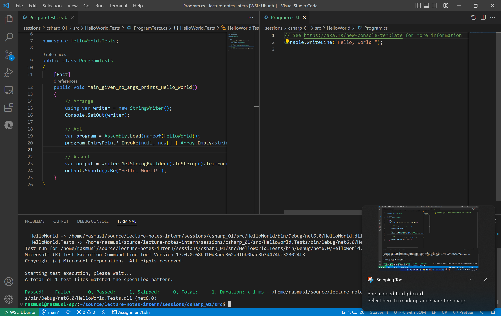
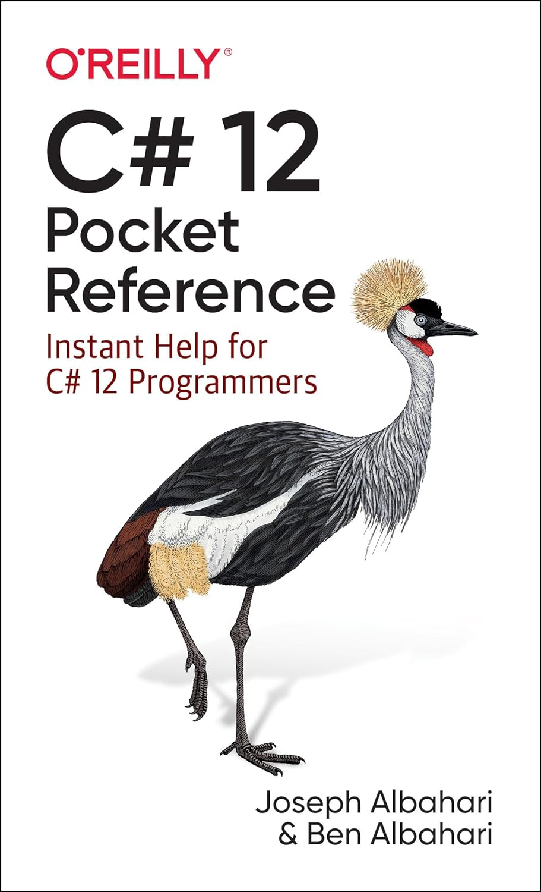
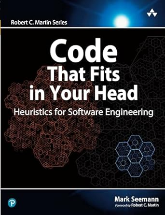
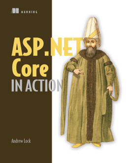
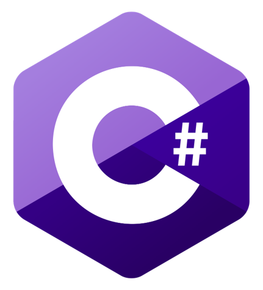
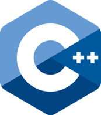
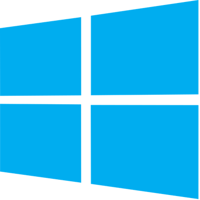
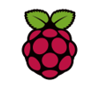
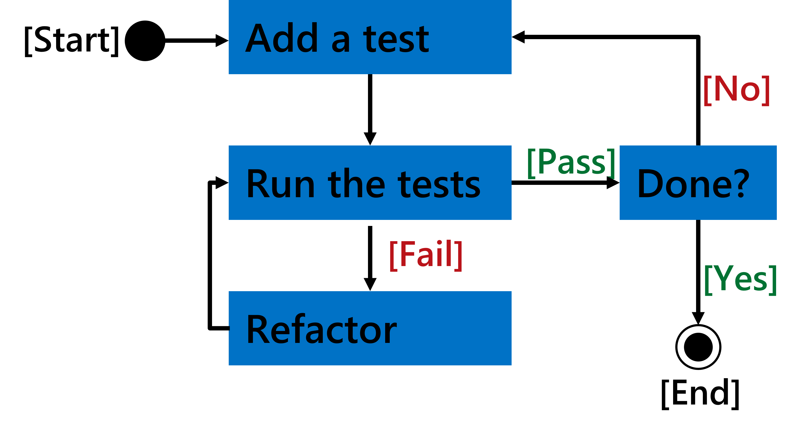
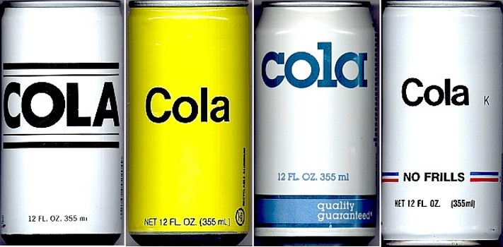

<style>
.container {
    height: 300px;
    width: 100%;
    display: block;
    justify-content: right;
    text-align: right;
}
</style>

<div class="container">

# C♯ Crash Course



Rasmus Lystrøm
Chief Disruptor
Microsoft Danmark

</div>

---

# About Me


Senior Cloud Solution Architect @ Microsoft (2013-)
Associate Professer @ ITU (2014-)

M[]().Sc. IT, ITU (2012)
Thesis: *Forecalc – Developing a core spreadsheet implementation in F♯*

---

# Source

<https://github.com/ondfisk/crash>

---

# Disclaimer

---

# Books

<br>
<br>
<br>
<br>
<br>
<br>
<br>
<br>
<br>
<br>
<br>
<br>





---

# Online Training

[C♯ language documentation](https://learn.microsoft.com/en-us/dotnet/csharp/)

[Free Foundational C# with Microsoft Certification](https://www.freecodecamp.org/learn/foundational-c-sharp-with-microsoft/)

[LinkedIn Learning](https://www.linkedin.com/learning/topics/c-sharp)

---

# C♯

> "C♯ is intended to be a simple, modern, general-purpose, object-oriented programming language."

ECMA-334 ISO/IEC 23270:2018(E)
C♯ language specification, 5th edition, December 2017

---

# Why C♯

- Popular cf. [Stack Overflow Annual Developer Survey 2025](https://survey.stackoverflow.co/2024/) at 27%
- Ubiquitous
- Open Source
- Cross-platform
- Industry / Enterprise
- Tool for your toolbox
- .NET CLR

---

# Why not C♯

## It's just like Java

- Curly brackets and semicolons from C
- Statically typed
- Object-oriented
- Single inheritance
- Cross-platform
- Open source
- Industry / enterprise
- JVM

---


<br>
<br>
<br>
<br>
<br>
<br>
<br>
<br>
<br>
<br>
<br>
<br>

# .NET - a brief introduction

---

# .NET

> .NET is a free, cross-platform, open source developer platform for building many different types of applications.
>
> With .NET, you can use multiple languages, editors, and libraries to build for web, mobile, desktop, games, IoT, and more.

<https://dotnet.microsoft.com/en-us/learn/dotnet/what-is-dotnet>

---

<!-- _class: default -->






<br>
<br>
<br>
<br>
<br>
<br>
<br>
<br>
<br>

# .NET Languages

<https://dotnet.microsoft.com/en-us/languages>

---

<!-- _class: default -->







<br>
<br>
<br>
<br>
<br>
<br>
<br>
<br>
<br>

# .NET Platforms

---

# .NET Timeline

<small>

2002: **.NET Framework**, **Visual C♯**, **Visual J♯**, **Visual Basic**, **Visual Studio .NET**
2005: .NET Framework 2.0, **F♯**, Generics
2007: .NET Framework 3.5, Auto-properties, Linq, Lambda
2010: .NET Framework 4.0, Dynamic, Parallel
2012: .NET Framework 4.5, Async/await
2016: **.NET Core**, Open Source on [GitHub](https://github.com/dotnet)!, **Visual Studio Code**
2017: .NET Core 2
2019: .NET Core 3, **.NET Framework 4.8**
2020: **.NET 5**
2021: .NET 6, Visual Studio 2022
2022: .NET 7
2023: .NET 8
2024: .NET 9

</small>

---

# .NET Framework vs. .NET (Core)

## .NET Framework

> The .NET Framework (pronounced as "dot net") is a proprietary software framework developed by Microsoft that **runs primarily on Microsoft Windows**.
>
> It was the predominant implementation of the Common Language Infrastructure (CLI) until being superseded by the cross-platform .NET project.

Version 4.8 (2019) is the *last* and *final* version.
Security patches only going forward.

---

# .NET Framework vs. .NET (Core)

## .NET

> The .NET platform (pronounced as "dot net") is a free and open-source, managed computer software framework for Windows, Linux, and macOS operating systems.
>
> The project is mainly developed by Microsoft employees by way of the .NET Foundation and is released under an MIT License.

Released yearly each november with *even* versions having *LTS* (3 years).
Next version will be **.NET 10 (LTS)** due November 2025.

---

# Demo

## `Hello, World!`

Inspect the `Console` class

Top-level statements

## `Hello, [User]!`

Inspect the `string` class and an instance of it

---

# Pair Programming

Two programmers work together at one workstation

One, the driver, writes code while the other, the observer or navigator, reviews each line of code as it is typed in. The two programmers switch roles frequently.

**Note**: You switch *at least* between each exercise.

---

# Exercise 1

Create a console application.

The application should display `Hello, World!` when run.

The application should display `Hello, <input>!` when run with `<input>` as the first command line argument.

The application should crash with an `ArgumentOutOfRangeException` if run with more than one command line argument.

---

# Demo

## Debugging `Hello, World!`

---

<!-- _class: default -->


<br>
<br>
<br>
<br>
<br>
<br>
<br>
<br>
<br>
<br>
<br>
<br>

# Test-Driven Development

---

# Test-Driven Development

- What?
- Why?
- How?

---

<!-- _class: default -->



<br>
<br>
<br>
<br>
<br>
<br>
<br>
<br>
<br>
<br>
<br>
<br>
<br>

# Red-Green-Refactor

---

# Demo

Test-Driven C♯

Including:

- Solution Structure
- [NuGet](https://nuget.org/)
- `dotnet outdated`

---

# Built-in Types

```csharp
bool boolean = true;
char character = 'a';
char[] array = ['a', 'b', 'c'];
void // return no value
var // implicitly typed local variable

// Integral numeric types
byte b = 255;                                    sbyte b = 127;
int i = 2147483647;                              uint ui = 4294967295;
long l = 9223372036854775807;                    ulong ul = 18446744073709551615;
short s = 32767;                                 ushort us = 65536;

// Floating point numeric types                  Reference types
decimal d = 79228162514264337593543950335;       object obj;
double d = 1.79769313486232E+308;                string str;
float f = 3.402823E+38;                          dynamic dyn;
```

[Built-in types](https://docs.microsoft.com/en-us/dotnet/csharp/language-reference/builtin-types/built-in-types)

---

# Operators

- `=`, `+=`, `-=`, `*=`, `/=`
- `+`, `-`, `*`, `/`, `%`
- `&`, `&&`, `|`, `||`, `^`
- `==`, `!=`, `<`, `>`, `<=`, `>=`, `is`, `as`,
- `??`, `?` `:`
- `!`, `?`
- `=>`
- `(` `)`

[C# operators and expressions](https://learn.microsoft.com/en-us/dotnet/csharp/language-reference/operators/)

---

# Conditionals

```csharp
int number = 42;
string output;

if (number == 42)
{
    output = "You have the answer!";
}
else
{
    output = "You do not have the answer!";
}
```

```csharp
var output = number == 42
    ? "You have the answer!"
    : "You do not have the answer!"
```

---

# Methods

```csharp
public static bool IsEven(int number)
{
    return number % 2 == 0;
}
```

```csharp
private string _name;

public void PrintName()
{
    Console.WriteLine(_name);
}
```

---

# Switch Statement

```csharp
static void ShowCard(int cardNumber)
{
    switch (cardNumber)
    {
        case 13:
            Console.WriteLine("King");
            break;
        case 12:
            Console.WriteLine("Queen");
            break;
        case 11:
            Console.WriteLine("Jack");
            break;
        default:
            Console.WriteLine(cardNumber);
            break;
    }
}
```

---

# Strings

```csharp
int number = 42;

string answer1 = "The answer is " + number;

var answer2 = $"The answer is {number}";

var same = answer1 == answer2; // true

var escaped = "C:\\Users\\account\\Source\\Repos\\crash\\src\\Exercise3\\Wizards.csv";

var verbatim = @"C:\Users\account\Source\Repos\crash\src\Exercise3\Wizards.csv";
```

---

# `foreach`

```csharp
string[] cars = {"Mercedes Benz", "BMW", "Porsche"};

foreach (var car in cars)
{
    Console.WriteLine(car);
}
```

---

# `for`

```csharp
for (int i = 0; i < 5; i++)
{
    Console.WriteLine(i);
}
```

---

# `while`

```csharp
int i = 0;
while (i < 5)
{
    Console.WriteLine(i);
    i++;
}
```

**Note**: There is also a `do`/`while` loop

---

# `break`

```csharp
var numbers = Enumerable.Range(1, 1000);

foreach (var number in numbers)
{
    if (i == 42)
    {
        Console.WriteLine("Found it!");
        break;
    }
}
```

---

# `continue`

```csharp
var numbers = Enumerable.Range(1, 1000)
                        .OrderBy(_ => Guid.NewGuid())
                        .Take(10);

foreach (var number in numbers)
{
    if (i % 2 == 1)
    {
        continue;
    }
    Console.WriteLine($"Found even number: {i}");
}
```

---

# Exercise 2

Clone: `git clone https://github.com/ondfisk/crash.git`

Implement a set of functions using the keywords `foreach`, `for`, `while`, `break`, `continue` and:

- `src/Exercise2/ArrayFunctions.cs`
- `tests/Exercise2.Tests/ArrayFunctionsTests.cs`

Implement test `-->` Implement (part of) method.

Rinse and repeat.

---

# Enums

```csharp
public enum Currency
{
    DNK,
    EUR,
    USD,
    GBP
}
```

---

# Records

```csharp
public record Money(Currency Currency, decimal Amount);

Money eur = new(Currency.EUR, 42);

Money dnk = eur with { Currency = Currency.DNK, Amount = eur.Amount * 7.6m };

```

---

# Classes

```csharp
public class Container
{
    private readonly int _initialCapacity;

    private int _capacity;

    public int Capacity => _capacity;

    public Container(int capacity) => _initialCapacity = _capacity = capacity;

    public void IncreaseCapacity(int extra)
    {
        _capacity += extra;
    }
}

var container = new Container(42);

container.IncreaseCapacity(624);

Console.WriteLine($"The container has currently a capacity of: {container.Capacity}");
```

---

# Classes

```csharp
public class Container
{
    public int Capacity { get; set; }
}

var container = new Container();
container.Capacity = 42;

var container = new Container { Capacity = 42 };
```

---

# Properties

```csharp
public class SomeType
{
    public required string Needed { get; set; }

    public required string NeededSetOnce { get; init; }

    public int ReadOnly { get; } = 42;

    public int WriteOnly { private get; set; }

    public string? ModifyInput
    {
        get;
        set => field = value.Trim();
    }
}
```

**Note**: Other modifiers: `internal`, `protected`, and `protected internal`.

---

Exercise 3

Part 1, 2, and 3

---



<br>
<br>
<br>
<br>
<br>
<br>
<br>
<br>
<br>
<br>
<br>
<br>

# Generic collections

---

<!-- _class: default -->

# `System.Collections.Generic`


---

# Generic collections

```csharp
List<int> list = [ 1, 2, 3 ];

ISet<int> stack = new HashSet<int> { 1, 2, 3 };

var queue = new Queue<int>();
queue.Enqueue(42);
var peek = queue.Peek();
var item = queue.Dequeue();

var stack = new Stack<string>();
stack.Push("Item");
var peek = stack.Peek();
var item = stack.Pop();
```

---

<!-- _class: default -->

# `System.Collections.Generic` - Key/Value


---

# Lambda Expressions


---

# Lambda Expressions

```csharp
Action<string> write = s => Console.WriteLine(s);

Func<int, int> square = a => a * a;
```

```csharp
Predicate<City> b = c => c.Name.StartsWith("B");

Converter<double, double> fahrenheitToCelsius = c => c * 9.0 / 5.0 + 32.0;

...
```

---

# Local Functions

```csharp
int square(int a) { return a * a; };

Console.WriteLine(square(16));
```

---

# Anonymous types

```csharp
var question = new
{
    Title = "The answer...?",
    Answer = 42
};
```

---

# Tuples

```csharp
var s = Tuple.Create("Clark Kent", "Superman");

var b = ("Bruce Wayne", "Batman");

var f = (name: "Barry Allen", alterEgo: "The Flash");

var random = new Random();

IEnumerable<(float x, float y)> GenerateRandomCoordinates()
{
    yield return (random.NextSingle() * 100, random.NextSingle() * 100);
}
```

---

# Collection Initializer

```csharp
IEnumerable<City> cities = new[]
{
    new City(1, "Berlin"),
    new City(2, "Hamburg"),
    new City(3, "Frankfurt")
};
```

---

# Data: Collection + Object Initializer

```csharp
IEnumerable<City> cities = 
[
    new { Id = 1, Name = "Berlin" },
    new { Id = 2, Name = "Hamburg" },
    new { Id = 3, Name = "Frankfurt" }
];
```

---

<!-- _class: default -->


<br>
<br>
<br>
<br>
<br>
<br>
<br>
<br>
<br>
<br>
<br>
<br>

# Extension Methods

---

# Built-in Extension methods

```csharp
var count = cities.Count();

var sort = cities.OrderBy(c => c.Name);

var filter = cities.Where(c => c.Name.Contains("i"));

var pick = cities.FirstOrDefault(c => c.Id == 2);

var all = cities.All(c => c.Name.Length < 10);

var any = cities.Any(c => c.Name.StartsWith("B"));

var project = cities.Select(c => c.Name);
```

---

# Create your own extension method

```csharp
public static class Extensions
{
    public static int WordCount(this string str) =>
        str.Split(new[] { ' ', '.', '?' },
                  StringSplitOptions.RemoveEmptyEntries)
           .Length;
}
```

---

# Extension methods

## Demo

---

Exercise 3

Part 4, 5, 6, 7, and 8

---


<br>
<br>
<br>
<br>
<br>
<br>
<br>
<br>
<br>
<br>
<br>
<br>

# Thank you

---

# Appendix

---

# Create a C♯ console app with a test library

```bash
mkdir MyApp
cd MyApp

dotnet new console -o src/MyApp
dotnet new xunit -o tests/MyApp.Tests

dotnet new sln
dotnet sln add src/MyApp
dotnet sln add tests/MyApp.Tests
dotnet add tests/MyApp.Tests reference src/MyApp

dotnet build
dotnet test
dotnet run --project src/MyApp

dotnet list package --outdated
dotnet tool install dotnet-outdated-tool --global
dotnet outdated -u
```

---

# The C♯ class

```csharp
namespace Namespace;

public class Class
{
    private string _field;
        
    protected DateTime _fieldAvailableInSubClass;
        
    public string Property { get => _field; } // Getter
        
    public int AutoProperty { get; set; }
        
    public Class() { }

    public string InstanceMethod(string parameter)
    {
        return $"Hello {parameter}";
    }

    public virtual bool OverridableInstanceMethod(bool parameter) => !parameter;

    public static void StaticMethod() { }
       
    private void PrivateInstanceMethod() { }

    public event EventHandler Event;

    protected virtual void OnEvent(EventArgs e)
    {
        EventHandler handler = Event;
        handler?.Invoke(this, e);
    }

    public delegate void MyEventHandler(object sender, EventArgs e);
}
```

---

# Naming Conventions

**Composed names**
`currentLayout`, `CurrentLayout`

**Variables and fields**
`vehicle`, `leftElement`

**Private fields**
`_vehicle`, `_leftElement`

**Methods**
`CurrentVehicle()`, `Size()`

**Properties**
`Pi`, `Name`, `Size`

**Classes**
`MyClass`, `List<T>`

**Interfaces**
`IException`, `IObserver`

<https://docs.microsoft.com/en-us/dotnet/standard/design-guidelines/naming-guidelines>

---

# Basic Unit Test

```csharp
public class Ticker
{
    public int Counter { get; private set; }
    public void Increment() => Counter++;
    public Ticker(int start = 0) => Counter = start;
}

public class TickerTests
{
    [Fact]
    public void Increment_when_called_increases_Counter_by_1()
    {
        // Arrange
        var sut = new Ticker(41);

        // Act
        sut.Increment();

        // Assert
        sut.Counter.Should().Be(42);
    }
}
```
